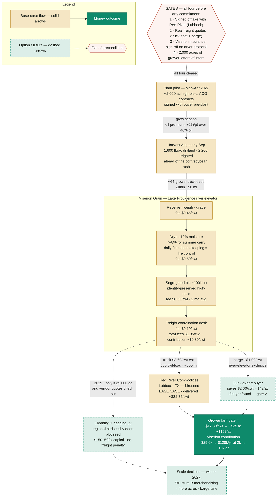

# Sunflowers 2027 — Processing Feasibility Research

Research outline for starting sunflower processing in East Carroll Parish, Louisiana and the surrounding Delta (northeast LA, southeast AR, west MS).

Sunflowers grow well here, but there is **no local processing or buyer** — this repo holds the research on what it would take to change that.

- **[REPORT.md](REPORT.md)** — the full fact-checked research report: processing pathways, market prices, nearest buyers and freight, elevator-partnership model, grants, and next steps.
- **[VISERION_PLAN.md](VISERION_PLAN.md)** — partnership proposal and full financial model for Viserion Grain's Lake Providence river elevator (fee schedule, P&L tiers, grower economics, sensitivity, go/no-go gates).
- **[deck/viserion_deck.html](deck/viserion_deck.html)** — slide deck for the Viserion pitch meeting.

## How the Viserion program works

Generated 2026-07-20 from a multi-source deep-research pass (22 sources fetched, 76 claims extracted, 25 adversarially verified: 20 confirmed, 5 refuted).
